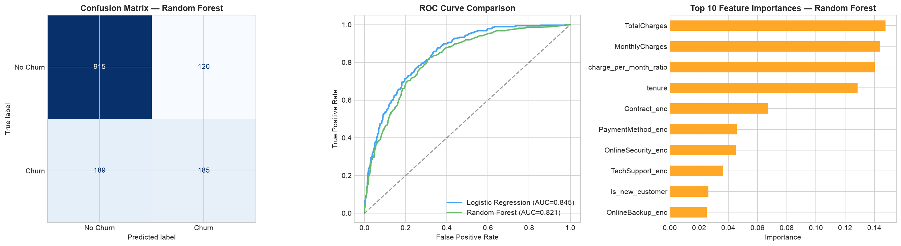

# Customer Churn Prediction Pipeline

**Tools:** Python (pandas, scikit-learn, matplotlib, seaborn) · SQL (sqlite3) · Plotly.js · GitHub Pages
**Dataset:** IBM Telco Customer Churn sample, via [Kaggle](https://www.kaggle.com/datasets/blastchar/telco-customer-churn). 7,043 customers, charges in US dollars. This is a public teaching dataset for a fictional telecom company, not real company data.
**Best model:** Logistic regression, 80.4% accuracy and AUC 0.845 on a 20% hold-out (5-fold cross-validated AUC 0.848 ± 0.013). For context, always predicting "no churn" scores 73.5% accuracy, so AUC is the more meaningful number.
**Live dashboard:** [View the interactive dashboard](https://mayankjoshiii.github.io/customer-churn-prediction/)



---

## Problem

About 26.5% of customers in this dataset churned. Can we predict who is likely to leave, and turn that into a sensible retention offer?

## Approach

| Step | What happens | Where |
|------|-------------|-------|
| 1. SQL exploration | Churn rate by contract type and tenure band, queried with `sqlite3` | notebook |
| 2. Cleaning | 11 blank `TotalCharges` values (brand-new customers) filled with the median | both |
| 3. Feature engineering | Charge-per-month ratio, new-customer flag (tenure 6 months or less), high-charge flag (over $70) | both |
| 4. Modelling | Logistic regression (scaled) and random forest, 80/20 stratified split, scaler fitted on training data only | both |
| 5. Validation | 5-fold cross-validated AUC on the training split | both |
| 6. Evaluation | Confusion matrix, ROC curves, random forest feature importances | both |
| 7. Business output | Out-of-fold churn probabilities for a high-risk segment and an illustrative retention estimate | notebook |

`churn_model.py` and `churn_pipeline.ipynb` use the same method and give the same numbers.

## Results (20% hold-out, 1,409 customers)

| Model | Accuracy | AUC-ROC | 5-fold CV AUC | Precision (churn) | Recall (churn) |
|-------|----------|---------|---------------|-------------------|----------------|
| **Logistic regression** | **80.4%** | **0.845** | **0.848 ± 0.013** | 0.66 | 0.53 |
| Random forest | 78.1% | 0.821 | 0.826 ± 0.014 | 0.61 | 0.50 |

Recall on the churn class is only about 0.5 at the default 0.5 threshold, so in practice you would lower the threshold to catch more churners and accept more false alarms.

## What drives churn (straight from the data)

1. **Contract type:** month-to-month customers churn at 42.7%, against 11.3% on one-year and 2.8% on two-year contracts.
2. **Tenure:** customers in their first 6 months churn at 52.9%.
3. **Internet service:** fibre optic customers churn at 41.9%, against 19.0% for DSL.
4. **Payment method:** electronic cheque users churn at 45.3%, the highest of the four methods.

## Retention idea (illustrative)

The highest-risk segment, month-to-month + fibre optic + monthly charges over $70, has 2,017 customers (28.6% of the base), and 54% of them churned. If 30% of the likely churners in that segment accepted a discounted 12-month contract, around 325 customers and roughly $343K a year in revenue would be kept. **The 30% uptake is an assumption, not a measurement.** Change it in the last notebook cell to see how sensitive the estimate is.

## Repository structure

```
customer-churn-prediction/
├── index.html                              Interactive Plotly.js dashboard (GitHub Pages)
├── churn_model.py                          Reproducible pipeline; --export writes model_results.json
├── churn_pipeline.ipynb                    Notebook with SQL exploration, modelling and outputs
├── model_results.json                      Real model metrics, ROC points and importances used by the dashboard
├── model_evaluation.png                    Confusion matrix, ROC curves and feature importances
├── WA_Fn-UseC_-Telco-Customer-Churn.csv    Source dataset
└── requirements.txt
```

## Run it

```bash
git clone https://github.com/mayankjoshiii/customer-churn-prediction.git
cd customer-churn-prediction
pip install -r requirements.txt
python churn_model.py            # prints metrics
python churn_model.py --export   # also refreshes model_results.json for the dashboard
```

## Author

**Mayank Joshi**, Business and Data Analyst · MSc Business Analytics (Distinction), Swansea University
[LinkedIn](https://www.linkedin.com/in/mayank-joshi-analyst/) · [GitHub](https://github.com/mayankjoshiii)
